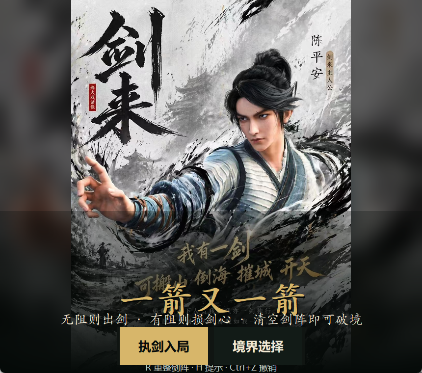
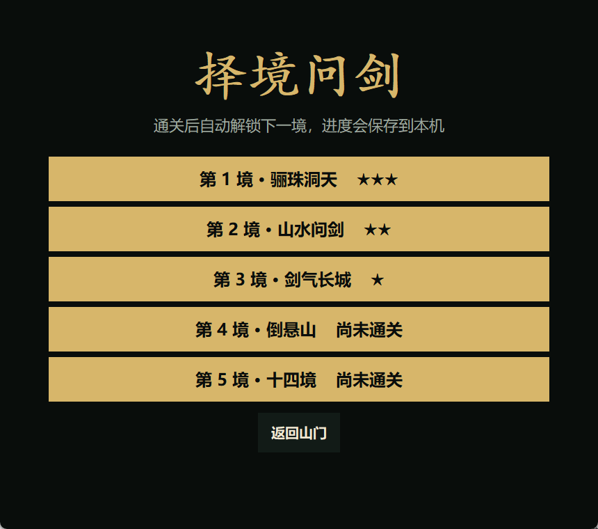
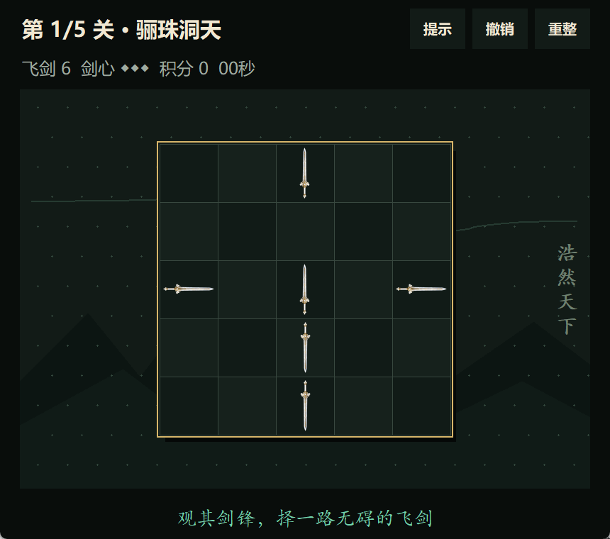
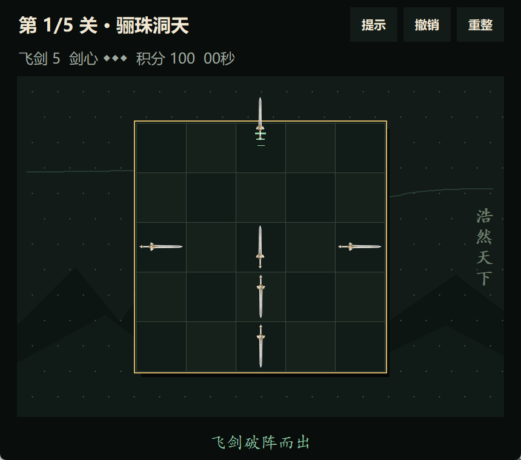
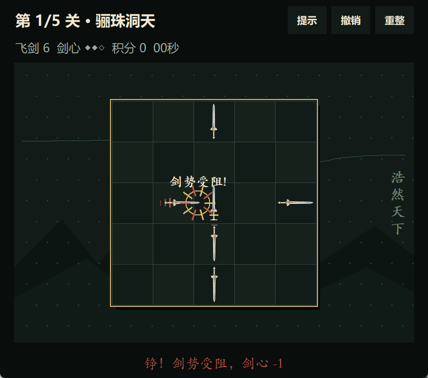
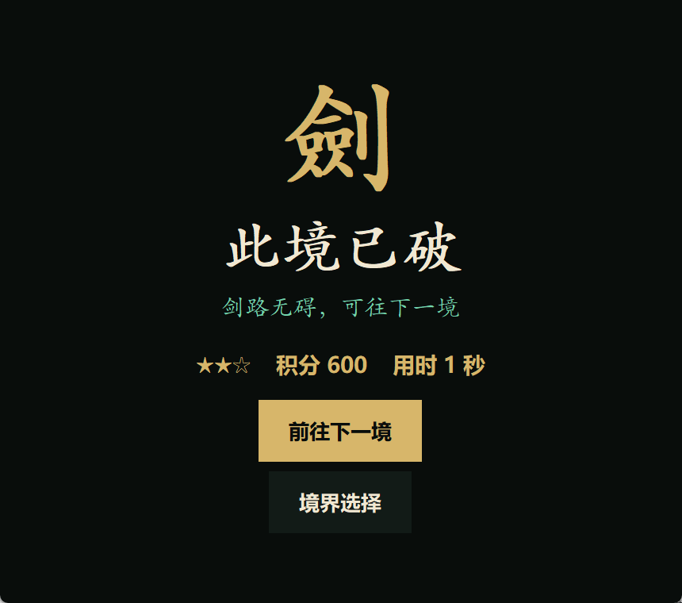

# 2026 秋软件工程个人作业（第二次）——一箭又一箭

## 作业信息

| 项目 | 内容 |
|---|---|
| 这个作业属于哪个课程 | [2026 秋软件工程与软件工程实践](https://edu.cnblogs.com/campus/fzu/2026-01SoftwareEngineeringandSoftwareEngineeringPractice) |
| 这个作业要求在哪里 | [2026 秋软件工程个人作业（第二次）](https://edu.cnblogs.com/campus/fzu/2026-01SoftwareEngineeringandSoftwareEngineeringPractice/homework/16718) |
| 这个作业的目标 | 使用 Python 和 AIGC 完成“一箭又一箭”小游戏 |
| 学号 | `<请填写>` |
| GitHub 仓库 | `<请替换为仓库链接>` |

## 1. 项目展示

本项目使用 Python 标准库 Tkinter 实现，无需安装第三方运行库。游戏包含开始、游玩、过关、失败和关卡选择界面，支持五关、碰撞反馈、飞出动画、提示、撤销、积分计时、星级评价和进度保存。视觉采用《剑来》题材启发的东方仙侠氛围：箭头改为四方向白玉金纹飞剑，五关分别为“骊珠洞天、山水问剑、剑气长城、倒悬山、十四境”，并加入水墨山河、青玉剑气、朱砂印章等元素。飞剑根据本人提供的参考图通过 AIGC 重新生成透明游戏素材，没有直接把完整参考图或动画官方图片放入项目。

开始界面使用本人提供的《剑来》人物海报，并通过居中保留、两侧暗化延展和底部渐变适配游戏窗口。图片来源或授权说明：`<提交前请补充>`。













## 2. 项目介绍

棋盘上的飞剑具有上、下、左、右四种方向，剑尖朝向就是移动方向。玩家点击飞剑后，程序沿飞剑方向检查同一行或同一列：若直到棋盘边缘都没有其他飞剑，飞剑破阵而出；若存在阻挡，飞剑碰撞回弹并扣除一点剑心。清空棋盘即可破境，剑心耗尽则本境失败。

我把程序分为规则层和界面层。`GameEngine` 只保存关卡、箭头、失误次数和状态，负责路径判断；`ArrowGameApp` 负责绘制棋盘、响应点击和播放反馈动画。这种拆分使核心规则能够在不启动图形界面的情况下自动测试。

路径检测的关键不是逐像素碰撞，而是判断是否存在满足以下条件的箭头：

- 上/下方向：与当前箭头同列，并位于对应方向；
- 左/右方向：与当前箭头同行，并位于对应方向。

若有多个阻挡物，则选择距离最近的一个用于高亮反馈。

## 3. AIGC 使用过程

### 记录一：需求拆分和结构设计

| 子任务 | 借助何种 AIGC 技术 | AI 实现或提供了什么 | 效果如何 | 人工修改 |
|---|---|---|---|---|
| 需求分析 | Codex | 将题目拆成规则、界面、关卡、测试和文档模块 | 得到清晰开发顺序 | 提交前需本人复核 |

我的要求：根据作业截图整理必须完成的功能，并给出适合小型 Python 图形项目的目录结构。

AI 提供了规则与界面分离的方案，并根据当前环境没有安装 Pygame 的情况，采用 `model.py + app.py + levels.py` 的轻量 Tkinter 结构。提交前我会亲自运行并确认这一选择。

### 记录二：路径检测实现

| 子任务 | 借助何种 AIGC 技术 | AI 实现或提供了什么 | 效果如何 | 人工修改 |
|---|---|---|---|---|
| 路径检测 | Codex | 生成四方向阻挡判断和最近阻挡物查找逻辑 | 自动测试通过 | 提交前需本人理解并复核 |

我的要求：实现同行、同列的箭头路径检测，不能让对角线箭头造成误判。

AI 先根据方向比较行列差，再筛选位于箭头前方的候选项，并加入“最近阻挡物”选择。T01～T03 已验证飞出、碰撞与棋盘边界；提交前我会再次手动操作这些场景。

### 记录三：测试与关卡检查

| 子任务 | 借助何种 AIGC 技术 | AI 实现或提供了什么 | 效果如何 | 人工修改 |
|---|---|---|---|---|
| 测试设计 | Codex | 生成核心功能测试和关卡可解性搜索思路 | 12 项测试可重复执行 | 提交前需本人核对结果 |

我的要求：按照作业给出的 T01～T06 场景编写自动化测试，并避免设计出无法通关的关卡。

实现中进一步使用状态搜索：每一步只移除当前无阻挡的箭头，若最终能到达空棋盘，则关卡可解。这样修改关卡数据后也能自动发现死局。我会在提交前阅读测试代码并复跑测试。

### 记录四：飞剑素材与飞出动画

| 子任务 | 借助何种 AIGC 技术 | AI 实现或提供了什么 | 效果如何 | 人工修改 |
|---|---|---|---|---|
| 主题美术 | 图像生成与 Codex | 根据参考图生成透明白玉金纹飞剑，并制作四方向素材与加速飞出动画 | 无圆形底座，剑尖方向清晰 | 对比两版后选择保留原始细长比例 |

我的要求：把原来的圆形箭头改成参考图中的白玉金纹飞剑，去掉剑周围的圆圈，并保留飞剑飞出棋盘的动态特性。

生成透明素材后，曾尝试缩短剑身并放大剑格以增强小图辨识度；对比两版后，最终选择更接近参考图的细长白玉剑比例。随后将该素材旋转为四个方向，并加入加速位移、三段剑气拖尾和光点效果。最终通过 GUI 冒烟测试确认无阻挡飞剑能够飞出并消失。

### 记录五：扩展功能与状态恢复

| 子任务 | 借助何种 AIGC 技术 | AI 实现或提供了什么 | 效果如何 | 人工修改 |
|---|---|---|---|---|
| 扩展功能 | Codex | 增加关卡选择、积分计时、星级、提示、撤销和本机存档 | 操作更完整，12 项测试通过 | 保留简单按钮和 JSON 存档，便于理解 |

我的要求：在基础功能正确的前提下，按照作业附加分示例增加实用功能，不让代码和操作变得过于复杂。

实现时把“提示”和“撤销”放入规则层：提示只返回当前无阻挡的飞剑；撤销保存点击前的飞剑、剑心、积分和状态快照。界面层负责计时、星级显示与关卡选择，解锁进度和最佳星级保存为用户目录下的 JSON 文件。新增两关后再次用状态搜索验证五关都存在通关顺序，并增加存档损坏时安全恢复初始状态的测试。

以上记录来自本次真实 AIGC 开发过程。程序和测试已经实际运行；“本人理解、人工修改与真实用时”应在提交者亲自复核后如实补充，不应虚构。

## 4. 测试结果

执行命令：

```powershell
python -m unittest discover -s tests -v
```

| 编号 | 测试内容 | 预期结果 | 实际结果 |
|---|---|---|---|
| T01 | 点击前方无阻挡的箭头 | 箭头飞出并消失 | 通过 |
| T02 | 点击前方有阻挡的箭头 | 箭头不消失，失误次数减 1 | 通过 |
| T03 | 点击位于边缘且朝向棋盘外的箭头 | 正常消失，不越界 | 通过 |
| T04 | 清除本关全部箭头 | 显示通关并进入下一关 | 通过 |
| T05 | 失误次数耗尽 | 显示失败并允许重开 | 通过 |
| T06 | 游戏中重新开始 | 布局和失误次数恢复 | 通过 |
| T07 | 检查全部原创关卡 | 五关全部存在通关路径 | 通过 |
| T08 | 请求提示 | 返回一支当前无阻挡的飞剑 | 通过 |
| T09 | 撤销操作 | 恢复飞剑、剑心和积分 | 通过 |
| T10 | 选择关卡 | 正确载入指定关卡 | 通过 |
| T11 | 保存并读取进度 | 解锁关卡和最佳星级一致 | 通过 |
| T12 | 存档文件损坏 | 安全恢复初始进度 | 通过 |

## 5. PSP 表格

> 请在提交前根据自己的真实用时填写“实际耗时”，不要照抄示例数字。

| 任务 | 预估耗时（小时） | 实际耗时（小时） | 差异（小时） |
|---|---:|---:|---:|
| 需求分析与游戏设计 | 0.5 |  |  |
| Python 与图形库学习 | 0.5 |  |  |
| 游戏界面实现 | 1.5 |  |  |
| 路径与碰撞逻辑实现 | 1.0 |  |  |
| 关卡设计 | 0.8 |  |  |
| AIGC 辅助开发 | 0.5 |  |  |
| 测试与修改 | 1.0 |  |  |
| README 与博客撰写 | 1.0 |  |  |
| 合计 | 6.8 |  |  |

## 6. 心得体会

这次作业让我体会到，图形界面只是游戏的表面，真正需要先想清楚的是状态和规则。如果把路径判断直接写进鼠标事件，功能增加后很难测试；把规则独立成 `GameEngine` 后，碰撞、过关和失败都能通过自动化测试验证。AIGC 能快速给出代码框架和测试思路，但关卡是否可解、边界是否正确仍需运行程序和编写测试来确认。对 AI 输出进行判断、修改和复测，比直接复制更重要。
